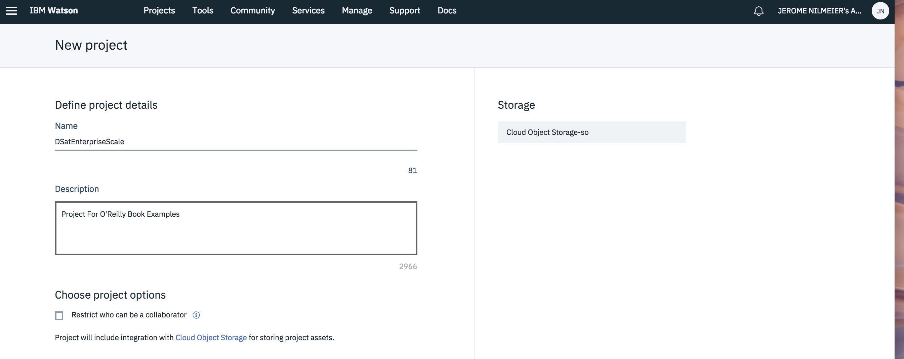
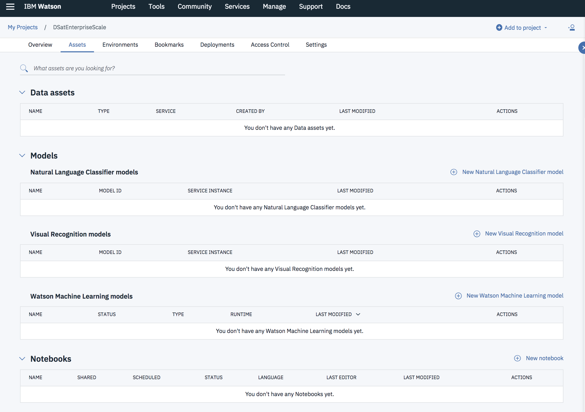
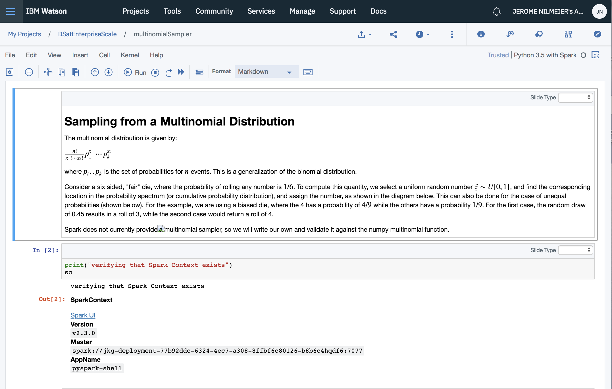
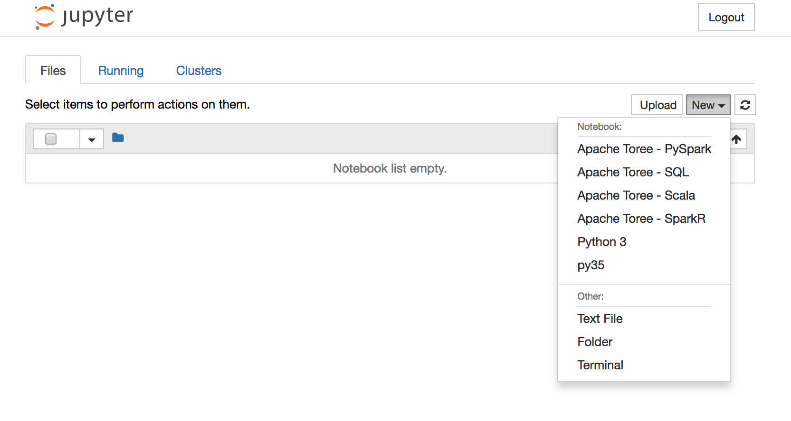
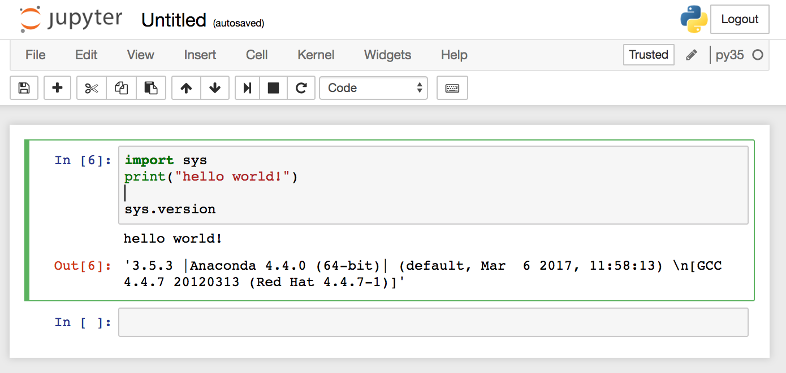
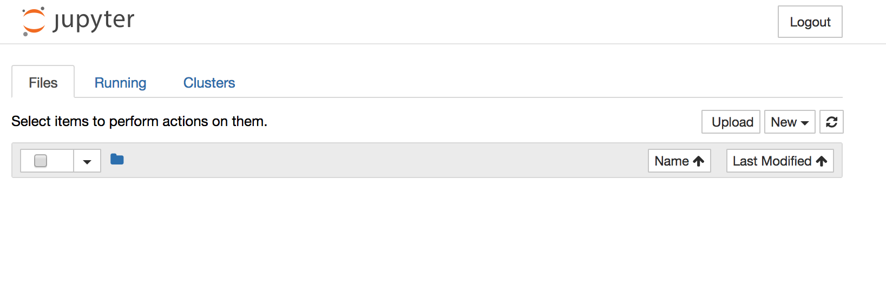

# Data Science at Enterprise Scale

This README closely follows Chapter 2 of "Data Science at Enterprise Scale".

Each approach is beneficial to go through, as you will be exposed to various technologies and services that are useful for you to understand.  The examples in this book are designed to be run in a laptop scale environment, which means that they can run on a single node.  No GPU or multinode (cluster) resources will be needed.  

Once you become familiar with these technologies at this scale, you can consider investing resources in the advanced hardware that will be needed to run enterprise scale workloads.  The great benefit of working with the code at this smaller scale is that the syntax is essentially unchanged on the more sophisticated hardware configurations.

## Quick Start with Watson Studio

Watson Studio is IBM's hosted Notebook Service, and is available by obtaining a free account at https://www.ibm.com/cloud/watson-studio.  Once you have created an account and logged in, you can begin by creating a project and notebook.

### Creating a Project and Importing a Notebook

Once you have logged in, you will see *IBM Watson* at the upper left corner.  To create a new Project, click the "*Projects*" tab, and select the "New Project" button.  The page for creating a new project should look like Figure 

should see a browser tab open that looks like this



You can name the project whatever you like.  Here we named it *DSatEnterpriseScale* because the github repository has the same name.  A project is a place for storing (among other services) notebooks and data.  Once the Project is created, you can go to the *Assets* tab and see what is available to you, as shown in the figure below.  For the purposes of this text, only Data assets and Notebooks will be used. 




#### Creating Spark Environments

By default, the Apache Spark environments that we will want to use are not available, so we will need to create these environments.  Some examples will be in scala and some will be in python, so we will create these two environments. 

*Creating an environment definition:*
* From the Environments tab in your project, click _New environment definition_.

* Enter a name and a description.  

* Select the environment type:  either Python 3.5 or Scala.  You will need to create both environments.

* Select at least 3 executors for each environment
====

#### Creating Your First Notebook

Click the *New notebook* tab from the Project Page  You can import this notebook directly from the github repo, or download the notebook and import it as a file.  You can also create a new notebook from scratch.  If you create it from scratch, you will need to specify the environment (Python 3.5 and Spark 2.3).  If you import the notebook, you may need to manually change the kernel.  If the notebook is imported, a security feature will prevent you from running the notebook until you mark it as a "trusted" notebook.

Once the notebook environment is created, you should be able to run code within the cells.  The first two cells are shown in the figure below.  The second cell will not run correctly if the Spark environment is not set up properly.  It is important to verify that your Spark Context exists in order to run the examples effectively.  A correctly initialized Spark Context will return the output as shown in the figure below.



You can run each cell (including markdown cells) with `Ctrl + Enter` or `Shift Enter` to see the results of each calculation.  
### Using Docker Images

Docker is an open source container framework that allows you to quickly build environments that do not affect the overall configuration of your system.  It can be a very quick and easy way to get started, and is a very popular option.  Installation of docker is relatively straightforward, and installation instructions can be found at https://www.docker.com/get-started[https://www.docker.com/get-started].  Build the docker image by typing:
  

```
$ docker build -t dses .
```


You will only need to build the image one time.  It will take several minutes to download all of the required packages.  After the image is built, you can type

```
docker run -it -p 8888:8888 dses
```

This will launch a jupyter instance hosted on `localhost:8888`.  The terminal will instruct you to browse to `http://localhost:8888/?token=someVeryLongString`.  Once you have browsed to this address, you can follow the instructions in the *Running Commands in Jupyter* Section.

### Installation of Apache Spark, TensorFlow, and Notebooks

We provide instructions for installing the frameworks used in this book for OSX and Linux systems.  For Windows systems, we recommend using a virtual machine environment that emulates a Linux OS.  For Linux systems, Ubuntu seems to be the preferred version when looking at TensorFlow installations.  The main components to be installed are:

* Apache Spark
* Jupyter Notebooks
* TensorFlow

### Installing Spark

Apache Spark is a framework for scalable computing.  You can, however, download it and run on a single compute node (your laptop works too).  The code can be written in `local` mode, and can then run on a cluster with larger scale data and computations without modifications.  The project is written entirely in scala, which compiles to java byte code.  As such, the java development kit (JDK) is needed.  

#### Installing Java

Java may be installed on your machine.  To check, simply type

```
$ java -version
```

For this book, we recommend java 8.  _Java 9 will not work for this version of Spark!_ Older versions of java may work, but we have not tested this for the examples presented. 

```
java version "1.8.0_161"
Java(TM) SE Runtime Environment (build 1.8.0_161-b12)
Java HotSpot(TM) 64-Bit Server VM (build 25.161-b12, mixed mode)
```

If you have a different version of java, you will want to install java 8, which is available [here](http://www.oracle.com/technetwork/java/javase/downloads/index.html).  Be sure to install the correct version, and the development kit (JDK), not just the runtime environment (JRE).  If you wish to maintain your original java version, you can install java 8 in a different directory and point to it by setting the environment variable `$JAVA_HOME`

```
export JAVA_HOME=/path/to/java8
```

Apache Spark will use this environment variable to access the java virtual machine (JVM).

#### Installing Spark Binary

Once the java environment is working, installation of Spark is very straightforward.  We will not attempt to set up the development environment here, and will only download the compiled code.  The binaries are available at https://spark.apache.org/downloads.html.  Be sure to pick version 2.3.0 and select the package type labeled "Pre-Built for Apache Hadoop 2.7 and later".  You will be redirected to a list of mirror sites, and we recommend picking a site closest to you and download the binary "spark-2.3.0-bin-hadoop2.7.tgz", and unzip to a convenient location in your directory structure.  You will need to set the `$SPARK_HOME` environment variable for the notebook applications to work correctly.

```
$ export SPARK_HOME=/path/to/spark-2.3.0-bin-hadoop2.7
```

If you wish to set this variable every time your terminal opens up, you can update your `.bash_profile` file (OSX), or your `.bashrc` file (Ubuntu and other Linux) with this shell command.

To test the installation, launch spark shell with the following command:

```
$ $SPARK_HOME/bin/spark-shell
```

You will see a splash screen that tells you what version you are using, and other settings that may be useful to know later on.

```
Setting default log level to "WARN".
To adjust logging level use sc.setLogLevel(newLevel). For SparkR, use setLogLevel(newLevel).
Spark context Web UI available at http://rally1.fyre.ibm.com:4040
Spark context available as 'sc' (master = local[*], app id = local-1531752157593).
Spark session available as 'spark'.
Welcome to
      ____              __
     / __/__  ___ _____/ /__
    _\ \/ _ \/ _ `/ __/  '_/
   /___/ .__/\_,_/_/ /_/\_\   version 2.3.0
      /_/

Using Scala version 2.11.8 (OpenJDK 64-Bit Server VM, Java 1.8.0_162)
Type in expressions to have them evaluated.
Type :help for more information.
```

Since the native language of Spark is scala, you will see a `scala>` prompt.  We will go into more detail about scala syntax later, but for now we only want to verify that an object called the Spark Context has been created.  This is called `sc` and is initialized byt the  `spark-shell` command.  The Spark Context s the portal to all things Spark, and contains all of the information required to communicate commands to a cluster of computers.  Of course, we are only using a local machine here for our examples, but it is possible to connect the Spark Context to a cluster of arbitrary size and run the same code at much larger scale.

To verify that this has been initialized properly, we can type:

```
scala> sc
```

You should see:

```
res0: org.apache.spark.SparkContext = org.apache.spark.SparkContext@3f322610
```

If you do not see something like this, something has gone wrong in creating the Spark Context, and you will not be able to run Spark commands.  You can also verify that the python API to Spark is working 

```
$SPARK_HOME/bin/pyspark
```

you should see a similar splash screen upon initialization, followed by a python shell prompt.  You should see a similar splash screen:

```
Welcome to
      ____              __
     / __/__  ___ _____/ /__
    _\ \/ _ \/ _ `/ __/  '_/
   /__ / .__/\_,_/_/ /_/\_\   version 2.3.0
      /_/

Using Python version 2.7.13 (default, Dec 20 2016 23:09:15)
SparkSession available as 'spark'.
```

The native version of python in many systems is 2.7.X, but this will vary, depending on your settings.  Note that `pyspark` will initialize based on the version of python associated with the `python` command, and is not tied to the Spark installation.  We shall see that this is the case once we update our version of python to 3.5.  

We can once again verify that the Spark Context exists by typing `sc` at the python shell prompt:

```
>>> sc
```

```
<SparkContext master=local[*] appName=PySparkShell>
```

More details on how to use Apache Spark are in Chapter 3.  Most examples are in notebook form, however, so we will need to install a notebook environment first.

### Creating the Python Environment

The first order of business is to create a python environment that will have the necessary libraries and dependencies in place.  This includes things like NumPy and Jupyter, which have complex dependencies and can present challenges if we were to install completely from scratch.  The Anaconda project will come to our rescue and provide the necessary libraries, as well as convenient ways of managing which version of python we choose to use.  We will follow installation


For Ubuntu systems, the installer is `apt`, and requires sudo access to use.  It is a good practice to use `sudo apt update` and `sudo apt upgrade`.  To obtain the `curl` command, which is used for installation, you must install with the installer.  The commands are as follows

(for Ubuntu)
```
$ sudo apt update
$ sudo apt upgrade
$ sudo apt install curl
```

Most OSX installations will have `curl` installed.  Download the Anaconda install script.  For Linux, the command is

```
$ curl -O https://repo.continuum.io/archive/Anaconda3-5.0.1-Linux-x86_64.sh
```
```
$ curl https://repo.continuum.io/archive/Anaconda2-5.1.0-MacOSX-x86_64.sh -o anaconda2.sh
```

At the end of the installation, you will be asked if you wish to prepend the anaconda installation to your `$PATH` variable.  We recommend that you select yes here.

Following https://conda.io/docs/user-guide/tasks/manage-python.html, we will create a separate environment with the recommended python version of 3.5.  From within this environment, we will add all of the libraries that will be used for this book.  This environment can have libraries installed separately from your native python environment, which can prevent dependency and versioning issues in the future.  We recommend python 3.5.  The most recent version of python (3.6 as of the writing of this text), does not seem to have full GPU support.  While this is not likely to be an issue for our needs, it is something to consider when creating environments in the future.  You will use the conda command utility to create this environment.

```
$ conda create -n py35 python=3.5 anaconda
```

Once your environment is created, you can activate the environment and launch the shell

```
$ source activate py35
(py35) $
```

NOTE: If you want to return to the native python environment, type `source deactivate`, and the prompt will return to normal, indicating that your native python installation will be available.

Notice that the prompt now shows the py35 environment.  Launch the python shell.

```
(py35) $ python 
```

A splash text will appear telling you which version is installed.

```
Python 3.5.5 |Anaconda, Inc.| (default, Mar  9 2018, 12:23:37)
[GCC 4.2.1 Compatible Clang 4.0.1 (tags/RELEASE_401/final)] on darwin
Type "help", "copyright", "credits" or "license" for more information.
>>>
```

For the remainder of the book, we will work in this python environment.  

### Installing Jupyter

Following https://conda.io/docs/user-guide/install/index.html

add this to bashrc or bash_profile

To launch jupyter notebook, simply type:

```
(py35) $ jupyter notebook
```

This command will launch jupyter in your default browser.  You should see a browser tab open that looks like the figure below



Under the "new" tab, select your kernel from the dropdown as `py35`.  This will open a new notebook with the correct kernel.
We encourage you to explore the notebook interface by running example code.  

For purposes of verifying the installation, you can run the code in the cell as shown in the figure below: 



To launch a jupyter session on a remote terminal, you need to tell jupyter what IP address to use when processing remote requests.  Since the session is running remotely, you will not want the remote server to try to launch a browser, since you will be connecting to it with your own local browser.

```
(py35) $ jupyter notebook --ip=999.99.99.9 --no-browser
```

For a remote server, use the ip address of server.  To obtain the ip address, type the shell command `ifconfig` and look for the address corresponding to `inet`.

You will see the following instruction for launching jupyter remotely:

```
Copy/paste this URL into your browser when you connect for the first time,
    to login with a token:
        http://999.99.99.9:8888/?token=someVeryLongString
```

When you point your browser to this address, you should see the same window as though you had run it from your local machine (see 2 figures above).


#### Running Commands in Jupyter

The Jupyter Project documentation (https://jupyter-notebook.readthedocs.io/en/stable/) is extensive, with great examples to get you accustomed to using the notebook interface.  

The basic idea is that there are input cells for you to enter code, and output cells that are returned by the kernel. 

#### Running Spark in Jupyter:  Apache Toree

IBM has released an open source project called [Apache Toree](https://toree.apache.org/) which allows Apache Spark to be run in scala from within the jupyter environment, as well as pyspark.  To install toree, use the pip installer.

```
(py35) $ pip install toree
```

Once this is installed, you will need to set an environment variable `$SPARK_OPTS` (you should have already set `$SPARK_HOME` previously).  In your `.bashrc` or `.bash_profile`, include

```
(py35) $ export SPARK_OPTS='--master=local[*]'
```

The `[*]` option specifies the number of threads, and `*` indicates that you wish to have as many threads as are available (you can specify a number as well if you know how many you want to use). 

```
(py35) $ jupyter toree install --interpreters=Scala,PySpark,SparkR,SQL
```

We will only use the scala and pyspark terminals for this manual, but it may be of interest to the reader to pursue the other interpreters.  Once toree is installed, you can launch jupyter notebook as usual, but you will now have several kernels to choose from.




The scala kernel is very useful because you can run scala interactively.  Since scala is the native language of Apache Spark, there can be advantages to writing code in scala, and an interactive interface can often be faster for people still learning the syntax.  You will have 2 options for running the python API to pyspark.  The first is to launch the toree pyspark kernel from the dropdown, and the second is to launch the py35 kernel and initialize the Spark kernel manually.  We will choose the second option for most of the examples in the book.  To install pyspark for use in the py35 kernel, 

### Installing Deep Learning Frameworks

If you are on a system without GPU support, you can install the basic version of tensorflow with the python index package manager.  The examples in this manual are intended to be run using only standard CPU resources, so the user can defer the effort required to set up or acquire accelerated hardware.

```
(py35)$ pip install tensorflow
```

If you have installed CUDA and have verified that it is working, you can install the GPU enabled version of tensorflow.
```
(py35) $ pip install tensorflow-gpu
```

In either case, you can verify that tensorflow has been installed by importing tensorflow at the interactive python shell. 

```
>>> import tensorflow as tf
```

You may get some output that depends on the state of your GPU connectivity.  If there are no errors, you should be able to access the newly created module

```
>>> tf
<module 'tensorflow' from '/path/to/my/anaconda2/envs/py35/lib/python3.5/site-packages/tensorflow/__init__.py'>
```

### All Set!

Ok, that's it for setting up your environment!  You should be able to run all of the examples in the remainder of the text through any of the three options discussed in this chapter.  We encourage you to run the notebooks for most of the examples, but you can also copy the code into text files and run them from either the python or scala REPL.  The Remaining chapters will mostly cover examples.


